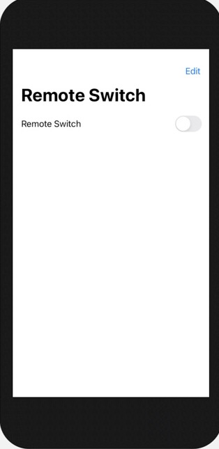
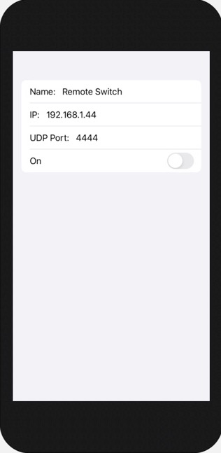

# RemoteSwitch
iOS simple app to control a WiFi-enabled relay such as https://github.com/creatica-soft/esp8266-relay over UDP.

The app uses SwiftUI and Network frameworks.

The app sends the string character value "0" to turn the relay off and "1" to turn it on.

It only supports a single remote relay. A relay name, its IP address, UDP port number and initial state are configurable and preserved in AppStorage.

